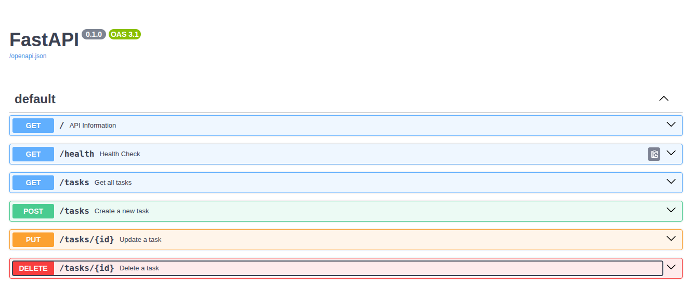

#  Task API - FastAPI CRUD Application

##  Overview

This project is a simple **CRUD (Create, Read, Update, Delete)** REST API built using **Python** and **FastAPI**.

It was developed as **Week 2 Assignment** for the **FlyRank Backend Engineering Internship Program**.

The API manages an in-memory to-do list and demonstrates the fundamentals of backend development using HTTP methods, REST APIs, status codes, request validation, and interactive API documentation with Swagger UI.

---

#  Features

- Create a task
- Read all tasks
- Read a single task
- Update a task
- Delete a task
- Request validation using Pydantic
- Proper HTTP Status Codes
- Interactive Swagger Documentation

---

#  Technologies Used

- Python 3.10
- FastAPI
- Uvicorn
- Pydantic

---

#  Project Structure

```

task-api/
│
├── app/
│ ├── main.py
│ └── models.py
│
├── requirements.txt
├── README.md
└── .gitignore

```

---

#  Installation

## Clone Repository

```bash
git clone https://github.com/Mukhtiar22/Flyrank-Assignments.git

cd task-api
```

---

## Create Virtual Environment

Ubuntu / Linux

```bash
python3 -m venv venv
```

Activate it

```bash
source venv/bin/activate
```

---

## Install Dependencies

```bash
pip install -r requirements.txt
```

---

#  Run the API

```bash
uvicorn app.main:app --reload
```

Server starts on

```

http://127.0.0.1:8000

```

---

#  Swagger Documentation

Interactive API documentation is available at

```

http://127.0.0.1:8000/docs

```

---

#  API Endpoints

| Method | Endpoint | Description |
|---------|----------|-------------|
| GET | `/` | API Information |
| GET | `/health` | Health Check |
| GET | `/tasks` | Get all tasks |
| GET | `/tasks/{id}` | Get task by ID |
| POST | `/tasks` | Create new task |
| PUT | `/tasks/{id}` | Update existing task |
| DELETE | `/tasks/{id}` | Delete task |

---

#  Example Request

Create Task

```http
POST /tasks
Content-Type: application/json

{
    "title":"Learn FastAPI"
}
```

---

#  Example Response

```json
{
    "id":4,
    "title":"Learn FastAPI",
    "done":false
}
```

Status Code

```
201 Created
```

---

#  Example curl Command

```bash
curl -i -X POST http://127.0.0.1:8000/tasks \
-H "Content-Type: application/json" \
-d '{"title":"Learn FastAPI"}'
```

Example Output

```http
HTTP/1.1 201 Created

{
    "id":4,
    "title":"Learn FastAPI",
    "done":false
}
```

---

#  Swagger Screenshot

Add your Swagger UI screenshot here.

Example

```

docs/swagger.png

```

Markdown

```markdown

```

---

#  HTTP Status Codes Used

| Status Code | Meaning |
|-------------|----------|
| 200 | Successful GET Request |
| 201 | Resource Created |
| 204 | Resource Deleted Successfully |
| 400 | Invalid Request |
| 404 | Resource Not Found |

---

#  Learning Outcomes

During this assignment I learned:

- REST API fundamentals
- CRUD operations
- FastAPI routing
- Request Body
- Path Parameters
- HTTP Status Codes
- Pydantic Validation
- Swagger UI
- Git & GitHub workflow

---

#  Note

This project stores all tasks in memory.

When the server restarts, all newly created tasks are lost because no database is connected.

This behavior is intentional for this assignment.

---

#  Author

**Mukhtiar Ali**

BS Computer Science

Sukkur IBA University

FlyRank Backend Engineering Internship - Week 2 Assignment